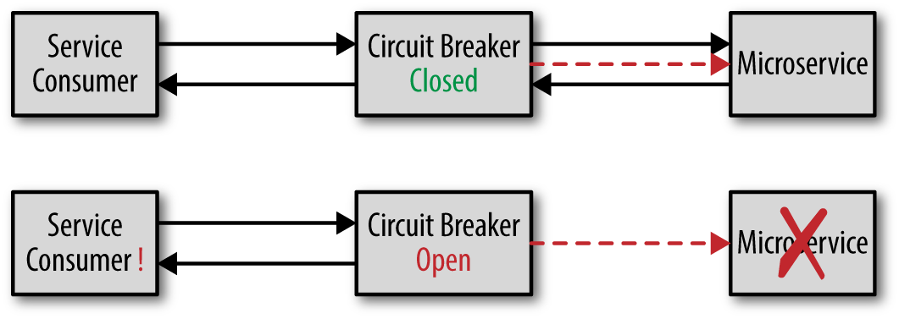

## Circuit Breaker



In a *Spring Boot* application, a **circuit breaker** is a ***design pattern** used to manage failures that may occur
when
communicating with **external systems** or **services**. It helps prevent **cascading failures** and improves overall
system
resiliency by isolating failing components.

The circuit breaker works by monitoring the number of **errors** that occur when a particular service is called. When
the
error **count reaches** a certain threshold, the circuit breaker trips and subsequent calls to that service are blocked
for
a specified period of time. During this time, the circuit breaker returns an error response immediately without
attempting to call the **downstream service**.
Once the **timeout period** has elapsed, the circuit breaker allows a limited number of requests to flow through to the
service to verify if it's still healthy. If these requests **succeed**, the circuit breaker closes and normal operation
resumes. However, if the requests continue to fail, the ***circuit breaker*** remains open, and the process repeats.

### Advantage

1. **Fault tolerance**: Microservices applications are often composed of multiple services that depend on each other to
   function. By using a circuit breaker, you can isolate and contain failures within a single service without impacting
   the
   rest of the system. This ensures that the overall system remains operational even if individual services experience
   issues.

2. **Scalability**: Circuit breakers can help improve the scalability of microservices applications by preventing
   bottlenecks
   caused by slow or unresponsive services. By quickly detecting and isolating failed services, the circuit breaker
   allows
   the remaining services to continue processing requests smoothly.

3. **Resilience**: Circuit breakers can help improve the resilience of microservices applications by automatically
   recovering
   from service failures. When a circuit breaker detects a failure, it can attempt to reconnect to the service after a
   period of time, reducing downtime and improving overall system availability.

4. **Monitoring and Insights**: Circuit breakers can provide insights into the health of individual services by
   monitoring
   their behavior in real-time. By collecting metrics such as error rates and response times, circuit breakers can help
   identify issues before they become critical and provide insights for optimizing the system.

5. **Security**: Circuit breakers can help improve the security of microservices applications by preventing malicious
   actors
   from exploiting vulnerabilities in individual services. By isolating and containing failed services, the circuit
   breaker
   can help prevent attacks from spreading throughout the system.

## Resilience4j

Resilience4j is a lightweight fault tolerance library designed for functional programming. Resilience4j provides
higher-order functions (decorators) to enhance any functional interface, lambda expression or method reference with a
Circuit Breaker, Rate Limiter, Retry or Bulkhead.

[Resilience4j doc](https://resilience4j.readme.io/docs)

#### How to config?
1. add these dependency to pom.xml file:
```xml

<dependency>
    <groupId>io.github.resilience4j</groupId>
    <artifactId>resilience4j-spring-boot2</artifactId>
</dependency>

<dependency>
    <groupId>org.springframework.boot</groupId>
    <artifactId>spring-boot-starter-aop</artifactId>
</dependency>

<dependency>
    <groupId>org.springframework.boot</groupId>
    <artifactId>spring-boot-starter-actuator</artifactId>
</dependency>
```

